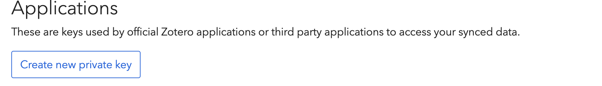
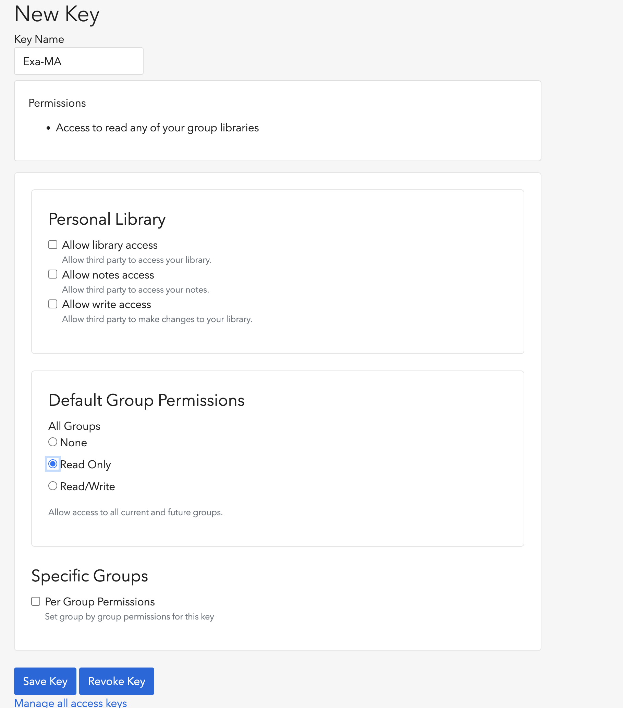

= Exa-MA D7.1 Report Automation
:experimental: true
//.Zenodo DOI
//--
//image::https://zenodo.org/badge/DOI/10.5281/zenodo.13341126.svg[DOI, link=https://doi.org/10.5281/zenodo.13341126]
//--

.GitHub Actions Status
--
image::https://github.com/numpex/exa-ma-d7.1/actions/workflows/latex.yml/badge.svg["Compile Latex and Release PDF", link="https://github.com/numpex/exa-ma-d7.1/actions/workflows/latex.yml"]
--

== Overview

This repository contains the automated workflow for compiling the Exa-MA D7.1 deliverable using LaTeX. 
The workflow is designed to compile LaTeX files, create PDF artifacts, and automatically release the generated document via GitHub releases. 
We use self-hosted runners from UNISTRA labeled `self-texlive` for the LaTeX compilation process.

== Clone the repository

[source,shell]
----
git clone https://github.com/numpex/exa-ma-d7.1
cd exa-ma-d7.1
bash a.cli setup # to be done only once after you clone the repo
----

NOTE: `a.cli` is a shell script to setup the repo, create release and update bibtex references.

== Compiling the deliverable

.Command line to compile fully the deliverable
[source, shell]
----
latexmk --shell-escape -pdf -file-line-error -halt-on-error -interaction=nonstopmode exa-ma-d7.1.tex
----

.Simple command line to compile once
[source, shell]
----
pdflatex --shell-escape exa-ma-d7.1.tex
----

== Update Zotero references

To update the references (`references.bib`), you have several options:

Download from Zotero:: download the file references.bib by exporting the exa-ma library from the GUI
Using `a.cli`:: setup the variable and run `a.cli update-bibtex`
+
[,console]
----

export ZOTERO_API_KEY=xxx
bash ./a.cli update-bibtex
----
+
to create the key go to https://www.zotero.org/settings/security[> Zotero Secutiry page] (and log in) 
+
then go to the **Applications** at the bottom of the **Secutiry** page
+

+
click btn:[Create new private key] then select group permission **Read only*. Then btn:[Save Key]. 
+

+
Then keep the key in a safe place and use it to to define `ZOTERO_API_KEY`

== Workflow Description

The repository utilizes GitHub Actions to automate the following tasks:

1. Compile the LaTeX document upon each push to specific branches or tags.
2. Upload the LaTeX artifacts, including the generated PDF, LaTeX sources, and associated files.
3. Run checks to ensure the document is properly compiled.
4. Release the compiled document automatically when a version tag is pushed.

The workflow primarily runs on UNISTRA's self-hosted runners (`self-texlive`) to take advantage of a tailored LaTeX environment optimized for compiling the project’s documents.

== Usage

To trigger the workflow:
- Push commits to a branch, or
- Push a tag with the format `v*` (e.g., `v1.0`, `v1.1-rc`).

The workflow will:

1. Set up the environment using the `self-texlive` runner.
2. Compile the LaTeX source files into a PDF using `latexmk` with shell escape enabled.
3. Upload the compiled PDF and other artifacts to GitHub for review.
4. Automatically create a release when a version tag is pushed.

== Workflow Structure

The workflow has several stages:

- Workflow Setup: Initializes the environment and selects the appropriate runner (self-hosted or GitHub runner).
- LaTeX Build: Compiles the LaTeX document using the UNISTRA `self-texlive` runner.
- Artifact Upload: Uploads the generated PDF and LaTeX sources as artifacts.
- Release: Packages the compiled artifacts and creates a GitHub release.

== Directory Structure

The repository is organized as follows:

- `chapters/`: Contains the individual chapters of the deliverable.
- `sections/`: Sections of the report.
- `software/`: Software-related sections.
- `graphics/`: Image files.
- `dat/`: Data files used in the report.
- `hooks/`: Git hooks.
- `litterature/`: References and bibliography.
- `README.adoc`: This file, providing an overview of the repository.
- `a.cli`: Shell script used for setup.

== Self-Hosted Runner (`self-texlive`)

The LaTeX document is built using UNISTRA’s self-hosted runners labeled `self-texlive`. These runners are pre-configured with the necessary TeXLive environment to compile complex LaTeX documents and ensure consistent results. The setup also supports LaTeX packages needed for this project.

== How to Contribute

1. Clone the repository.
2. Make changes to the LaTeX sources in the relevant directories (e.g., `chapters`, `sections`).
3. Commit and push your changes to a feature branch.
4. Create a pull request for review.
5. Once approved, merge the changes to the main branch or a release branch.

== Notes

- The workflow relies on the `self-texlive` runners provided by UNISTRA for building the LaTeX documents.
- Artifacts, including PDF and source files, will be available after each successful run under the "Actions" tab of the GitHub repository.
- The build process includes compiling with shell escape enabled to handle external dependencies.

== Requirements

- We have setup TexLive full in our Ubuntu runners 

== License

This project is licensed under the CC License. See the LICENSE file for details.

