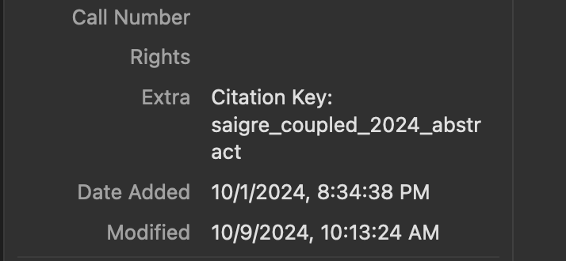

= Exa-MA D7.1 Report Automation
:experimental: true
:toc: preamble
:toclevels: 3
//.Zenodo DOI
//--
//image::https://zenodo.org/badge/DOI/10.5281/zenodo.13341126.svg[DOI, link=https://doi.org/10.5281/zenodo.13341126]
//--

.GitHub Actions Status
--
image::https://github.com/numpex/exa-ma-d7.1/actions/workflows/latex.yml/badge.svg["Compile Latex and Release PDF", link="https://github.com/numpex/exa-ma-d7.1/actions/workflows/latex.yml"]
--

.License
--
image::https://licensebuttons.net/l/by/4.0/88x31.png[CC BY 4.0, link="https://creativecommons.org/licenses/by/4.0/"]
--

== Overview

This repository contains the Exa-MA D7.1 deliverable document written in LaTeX with automated compilation workflows.
The project uses LaTeX with the `minted` package for syntax highlighting and requires special compilation flags.
Documents are automatically compiled using GitHub Actions with self-hosted TeXLive runners and can be compiled locally using various methods.

*Key features:*
- Automated LaTeX compilation with GitHub Actions
- VS Code integration with LaTeX Workshop
- Zotero bibliography management
- Release automation with version tagging
- Comprehensive error handling and troubleshooting

== Quick Start

=== Prerequisites

Before compiling, ensure you have:
- LaTeX distribution (TeX Live recommended)
- Python with Pygments library (for code syntax highlighting)
- Git (for version control and hooks)

.Installing Pygments
[source,shell]
----
# On macOS with Homebrew
brew install pygments

# On Ubuntu/Debian
sudo apt-get install python3-pygments

# Using pip
pip install pygments
----

=== Clone and Setup

[source,shell]
----
git clone https://github.com/numpex/exa-ma-d7.1
cd exa-ma-d7.1
./a.cli setup # to be done only once after you clone the repo
----

NOTE: `a.cli` is a shell script to setup the repo, create releases and update bibtex references.

== Compiling the Document

=== Method 1: Using latexmk (Recommended)

The recommended compilation method uses `latexmk` with shell escape enabled:

.Full compilation with latexmk
[source, shell]
----
latexmk --shell-escape -pdf -file-line-error -halt-on-error -interaction=nonstopmode exa-ma-d7.1.tex
----

*Key flags explained:*
- `--shell-escape`: Required for `minted` package (syntax highlighting)
- `-pdf`: Generate PDF output
- `-file-line-error`: Show file names and line numbers for errors
- `-halt-on-error`: Stop compilation on errors
- `-interaction=nonstopmode`: Continue compilation without user input

=== Method 2: Using VS Code

If you're using VS Code with the LaTeX Workshop extension:

1. Open the project in VS Code
2. The document will auto-compile when you save any `.tex` file
3. Use kbd:[Ctrl+Alt+B] (or kbd:[Cmd+Alt+B] on macOS) to manually build

The VS Code configuration is pre-configured in `.vscode/settings.json` with:
- Auto-build on save enabled
- Proper `latexmk` recipe with shell escape
- SyncTeX support for forward/backward search

=== Method 3: Single Pass Compilation

For quick testing (may require multiple runs for references):

.Single pdflatex run
[source, shell]
----
pdflatex --shell-escape exa-ma-d7.1.tex
----

=== Method 4: Using the CLI Helper

.Clean build artifacts
[source, shell]
----
./a.cli clean
----

=== Troubleshooting Compilation Issues

**Common errors and solutions:**

.Shell escape not enabled
----
Error: Package minted Error: You must invoke LaTeX with the -shell-escape flag.
----
*Solution:* Always use `--shell-escape` flag in your compilation command.

.Pygments not found
----
Error: Package minted Error: You must have 'pygmentize' installed.
----
*Solution:* Install Python and Pygments as shown in the Prerequisites section.

.Missing bibliography
If references are not showing up, ensure you have the latest `references.bib` file (see Zotero section).

== Bibliography Management with Zotero

The project uses Zotero for bibliography management with the ExaMA shared library.

=== Updating References

To update `references.bib`, you have several options:

==== Option 1: Using the CLI Script (Recommended)

[source,console]
----
export ZOTERO_API_KEY=your_api_key_here
./a.cli update-bibtex
----

==== Option 2: Manual Download from Zotero

Download `references.bib` by exporting the exa-ma library from the Zotero GUI.

=== Setting Up Zotero API Access

. Go to https://www.zotero.org/settings/security[Zotero Security Settings]
. Navigate to **Applications** at the bottom
. Click btn:[Create new private key]
. Select **Read only** group permissions
. Click btn:[Save Key]
. Store the key securely and use it for `ZOTERO_API_KEY`

.Zotero Applications Setup
image:graphics/zotero/zotero-applications.png[]

.Creating New API Key
image:graphics/zotero/zotero-newkey.png[]

=== Custom Citation Keys

.Citation Key Setup in Zotero
[.right]

To set custom citation keys, add the following to Zotero's **Extra** field:

[source,text]
----
Citation Key: author_title_year_type
----

*Example:* `Citation Key: saigre_coupled_2024_paper`

NOTE: When setting custom keys, ensure uniqueness to avoid conflicts.

== Automated Workflows

=== GitHub Actions Pipeline

The repository uses GitHub Actions for automated compilation and release management:

**Triggers:**
- Push to any branch: Compiles document and creates artifacts
- Push version tags (`v*`): Creates official releases with PDF

**Workflow stages:**
1. **Environment Setup**: Selects appropriate runner (self-hosted `self-texlive` or `ubuntu-latest`)
2. **Bibliography Update**: Automatically fetches latest references from Zotero (non-main branches)
3. **LaTeX Compilation**: Compiles document using `latexmk` with shell escape
4. **Artifact Creation**: Uploads PDF and source files
5. **Release Management**: Creates GitHub releases for tagged versions

**Self-hosted Runners:**
The project uses UNISTRA's `self-texlive` runners, pre-configured with:
- Complete TeXLive installation
- All required LaTeX packages
- Optimized compilation environment

=== Release Process

To create a new release:

[source,shell]
----
# Create and push a version tag
./a.cli create v1.0.0
----

This automatically:
1. Tags the repository
2. Updates version information
3. Triggers GitHub Actions
4. Creates a release with PDF artifact

=== Development Workflow

. **Setup**: `./a.cli setup` (one-time after clone)
. **Edit**: Modify `.tex` files as needed
. **Compile**: Use VS Code auto-build or manual `latexmk`
. **Clean**: `./a.cli clean` to remove build artifacts
. **Commit**: Git hooks automatically update version info
. **Release**: Tag with `./a.cli create vX.Y.Z` for releases

== Project Structure

The repository is organized as follows:

[cols="1,3"]
|===
| Directory/File | Description

| `exa-ma-d7.1.tex` | Main LaTeX document
| `chapters/` | Individual chapters of the deliverable
| `sections/` | Report sections and content
| `software/` | Software-specific sections
| `graphics/` | Images, figures, and visual content
| `references.bib` | Bibliography file (managed via Zotero)
| `numpex.sty` | Custom LaTeX style files
| `a.cli` | Command-line utility script
| `hooks/` | Git hooks for automation
| `.vscode/` | VS Code configuration
| `.github/workflows/` | GitHub Actions workflows
|===

=== Key Files

**LaTeX Files:**
- `exa-ma-d7.1.tex`: Main document entry point
- `defs.tex`: Definitions and macros
- `*.sty`: Custom style files (`numpex.sty`, `istcover.sty`, etc.)

**Configuration:**
- `.vscode/settings.json`: VS Code LaTeX Workshop configuration
- `.github/workflows/latex.yml`: Automated compilation workflow
- `gitHeadLocal.gin`: Version information (auto-generated)

== Contributing

=== How to Contribute

. **Clone and Setup**:
+
[source,shell]
----
git clone https://github.com/numpex/exa-ma-d7.1
cd exa-ma-d7.1
./a.cli setup
----

. **Make Changes**: Edit LaTeX sources in relevant directories (`chapters/`, `sections/`)

. **Test Compilation**: Ensure document compiles without errors:
+
[source,shell]
----
latexmk --shell-escape -pdf -interaction=nonstopmode exa-ma-d7.1.tex
----

. **Clean Up**: Remove build artifacts before committing:
+
[source,shell]
----
./a.cli clean
----

. **Submit**: Create a pull request for review

=== Best Practices

- **Always test compilation** before submitting changes
- **Use meaningful commit messages** that describe the changes
- **Update bibliography** when adding new references
- **Follow LaTeX conventions** for formatting and structure
- **Clean build artifacts** before committing

== CLI Reference

The `a.cli` script provides several useful commands:

[source,shell]
----
# Setup git hooks (run once after clone)
./a.cli setup

# Clean build artifacts
./a.cli clean

# Create a new release
./a.cli create v1.0.0

# List recent releases
./a.cli list

# Update bibliography from Zotero
./a.cli update-bibtex

# Get help
./a.cli --help
----

== Technical Notes

=== System Requirements

- **LaTeX Distribution**: TeX Live (full installation recommended)
- **Python**: Version 3.6+ with Pygments library
- **Git**: For version control and hooks
- **VS Code** (optional): With LaTeX Workshop extension for optimal experience

=== Self-Hosted Runners

The project uses UNISTRA's specialized `self-texlive` runners with:
- Pre-installed complete TeXLive distribution
- All required LaTeX packages
- Optimized compilation environment
- Automatic fallback to `ubuntu-latest` if unavailable

=== Compilation Notes

- **Shell escape is mandatory** due to the `minted` package for code highlighting
- **Multiple passes may be needed** for complete reference resolution
- **SyncTeX is enabled** for VS Code forward/backward search
- **Build artifacts are automatically cleaned** in CI/CD pipeline

== Additional Resources

- **AGENTS.md**: Comprehensive LaTeX compilation guide
- **GitHub Actions**: https://github.com/numpex/exa-ma-d7.1/actions[View build status]
- **Releases**: https://github.com/numpex/exa-ma-d7.1/releases[Download latest PDF]
- **Zotero Library**: ExaMA shared bibliography
- **VS Code LaTeX Workshop**: https://marketplace.visualstudio.com/items?itemName=James-Yu.latex-workshop[Extension documentation]

== License

This project is licensed under the CC License. See the LICENSE file for details.

.GitHub Actions Status
--
image::https://github.com/numpex/exa-ma-d7.1/actions/workflows/latex.yml/badge.svg["Compile Latex and Release PDF", link="https://github.com/numpex/exa-ma-d7.1/actions/workflows/latex.yml"]
--

== Overview

This repository contains the Exa-MA D7.1 deliverable document written in LaTeX with automated compilation workflows.
The project uses LaTeX with the `minted` package for syntax highlighting and requires special compilation flags.
Documents are automatically compiled using GitHub Actions with self-hosted TeXLive runners and can be compiled locally using various methods.

Key features::
+
- Automated LaTeX compilation with GitHub Actions
- VS Code integration with LaTeX Workshop
- Zotero bibliography management
- Release automation with version tagging
- Comprehensive error handling and troubleshooting

== Quick Start

=== Prerequisites

Before compiling, ensure you have:

- LaTeX distribution (TeX Live recommended)
- Python with Pygments library (for code syntax highlighting)
- Git (for version control and hooks)

.Installing Pygments
[source,shell]
----
# On macOS with Homebrew
brew install pygments

# On Ubuntu/Debian
sudo apt-get install python3-pygments

# Using pip
pip install pygments
----

=== Clone and Setup

[source,shell]
----
git clone https://github.com/numpex/exa-ma-d7.1
cd exa-ma-d7.1
bash a.cli setup # to be done only once after you clone the repo
----

NOTE: `a.cli` is a shell script to setup the repo, create release and update bibtex references.

== Compiling the Document

=== Method 1: Using latexmk (Recommended)

The recommended compilation method uses `latexmk` with shell escape enabled:

.Full compilation with latexmk
[source, shell]
----
latexmk --shell-escape -pdf -file-line-error -halt-on-error -interaction=nonstopmode exa-ma-d7.1.tex
----

Key flags explained::
+
- `--shell-escape`: Required for `minted` package (syntax highlighting)
- `-pdf`: Generate PDF output
- `-file-line-error`: Show file names and line numbers for errors
- `-halt-on-error`: Stop compilation on errors
- `-interaction=nonstopmode`: Continue compilation without user input

=== Method 2: Using VS Code

If you're using VS Code with the LaTeX Workshop extension:

1. Open the project in VS Code
2. The document will auto-compile when you save any `.tex` file
3. Use kbd:[Ctrl+Alt+B] (or kbd:[Cmd+Alt+B] on macOS) to manually build

The VS Code configuration is pre-configured in `.vscode/settings.json` with:

- Auto-build on save enabled
- Proper `latexmk` recipe with shell escape
- SyncTeX support for forward/backward search

=== Method 3: Single Pass Compilation

For quick testing (may require multiple runs for references):

.Single pdflatex run
[source, shell]
----
pdflatex --shell-escape exa-ma-d7.1.tex
----

=== Method 4: Using the CLI Helper

.Clean build artifacts
[source, shell]
----
./a.cli clean
----

=== Troubleshooting Compilation Issues

**Common errors and solutions:**

.Shell escape not enabled
----
Error: Package minted Error: You must invoke LaTeX with the -shell-escape flag.
----
*Solution:* Always use `--shell-escape` flag in your compilation command.

.Pygments not found
----
Error: Package minted Error: You must have 'pygmentize' installed.
----
*Solution:* Install Python and Pygments as shown in the Prerequisites section.

.Missing bibliography
If references are not showing up, ensure you have the latest `references.bib` file (see Zotero section).

== Bibliography Management with Zotero

The project uses Zotero for bibliography management with the ExaMA shared library.

=== Updating References

To update `references.bib`, you have several options:

==== Option 1: Using the CLI Script (Recommended)

[source,console]
----
export ZOTERO_API_KEY=your_api_key_here
./a.cli update-bibtex
----

==== Option 2: Manual Download from Zotero

Download `references.bib` by exporting the exa-ma library from the Zotero GUI.

=== Setting Up Zotero API Access

. Go to https://www.zotero.org/settings/security[Zotero Security Settings]
. Navigate to **Applications** at the bottom
. Click btn:[Create new private key]
. Select **Read only** group permissions
. Click btn:[Save Key]
. Store the key securely and use it for `ZOTERO_API_KEY`

.Zotero Applications Setup
image:graphics/zotero/zotero-applications.png[]

.Creating New API Key
image:graphics/zotero/zotero-newkey.png[]

=== Custom Citation Keys

.Citation Key Setup in Zotero
[.right]

To set custom citation keys, add the following to Zotero's **Extra** field:

[source,text]
----
Citation Key: author_title_year_type
----

*Example:* `Citation Key: saigre_coupled_2024_paper`

NOTE: When setting custom keys, ensure uniqueness to avoid conflicts.

== Automated Workflows

=== GitHub Actions Pipeline

The repository uses GitHub Actions for automated compilation and release management:

Triggers::
+
- Push to any branch: Compiles document and creates artifacts
- Push version tags (`v*`): Creates official releases with PDF

Workflow stages::
+
1. **Environment Setup**: Selects appropriate runner (self-hosted `self-texlive` or `ubuntu-latest`)
2. **Bibliography Update**: Automatically fetches latest references from Zotero (non-main branches)
3. **LaTeX Compilation**: Compiles document using `latexmk` with shell escape
4. **Artifact Creation**: Uploads PDF and source files
5. **Release Management**: Creates GitHub releases for tagged versions

Self-hosted Runners::
+
The project uses UNISTRA's `self-texlive` runners, pre-configured with:
- Complete TeXLive installation
- All required LaTeX packages
- Optimized compilation environment

=== Release Process

To create a new release:

[source,shell]
----
# Create and push a version tag
./a.cli create v1.0.0
----

This automatically:

1. Tags the repository
2. Updates version information
3. Triggers GitHub Actions
4. Creates a release with PDF artifact

=== Development Workflow

. **Setup**: `./a.cli setup` (one-time after clone)
. **Edit**: Modify `.tex` files as needed
. **Compile**: Use VS Code auto-build or manual `latexmk`
. **Clean**: `./a.cli clean` to remove build artifacts
. **Commit**: Git hooks automatically update version info
. **Release**: Tag with `./a.cli create vX.Y.Z` for releases

== Project Structure

The repository is organized as follows:

[cols="1,3"]
|===
| Directory/File | Description

| `exa-ma-d7.1.tex` | Main LaTeX document
| `chapters/` | Individual chapters of the deliverable
| `sections/` | Report sections and content
| `software/` | Software-specific sections
| `graphics/` | Images, figures, and visual content
| `references.bib` | Bibliography file (managed via Zotero)
| `numpex.sty` | Custom LaTeX style files
| `a.cli` | Command-line utility script
| `hooks/` | Git hooks for automation
| `.vscode/` | VS Code configuration
| `.github/workflows/` | GitHub Actions workflows
|===

=== Key Files

**LaTeX Files:**
- `exa-ma-d7.1.tex`: Main document entry point
- `defs.tex`: Definitions and macros
- `*.sty`: Custom style files (`numpex.sty`, `istcover.sty`, etc.)

**Configuration:**
- `.vscode/settings.json`: VS Code LaTeX Workshop configuration
- `.github/workflows/latex.yml`: Automated compilation workflow
- `gitHeadLocal.gin`: Version information (auto-generated)

== Technical Notes

=== System Requirements

- **LaTeX Distribution**: TeX Live (full installation recommended)
- **Python**: Version 3.6+ with Pygments library
- **Git**: For version control and hooks
- **VS Code** (optional): With LaTeX Workshop extension for optimal experience

=== Self-Hosted Runners

The project uses UNISTRA's specialized `self-texlive` runners with:
- Pre-installed complete TeXLive distribution
- All required LaTeX packages
- Optimized compilation environment
- Automatic fallback to `ubuntu-latest` if unavailable

=== Compilation Notes

- **Shell escape is mandatory** due to the `minted` package for code highlighting
- **Multiple passes may be needed** for complete reference resolution
- **SyncTeX is enabled** for VS Code forward/backward search
- **Build artifacts are automatically cleaned** in CI/CD pipeline

== Contributing

=== How to Contribute

. **Clone and Setup**:
+
[source,shell]
----
git clone https://github.com/numpex/exa-ma-d7.1
cd exa-ma-d7.1
./a.cli setup
----

. **Make Changes**: Edit LaTeX sources in relevant directories (`chapters/`, `sections/`)

. **Test Compilation**: Ensure document compiles without errors:
+
[source,shell]
----
latexmk --shell-escape -pdf -interaction=nonstopmode exa-ma-d7.1.tex
----

. **Clean Up**: Remove build artifacts before committing:
+
[source,shell]
----
./a.cli clean
----

. **Submit**: Create a pull request for review

=== Best Practices

- **Always test compilation** before submitting changes
- **Use meaningful commit messages** that describe the changes
- **Update bibliography** when adding new references
- **Follow LaTeX conventions** for formatting and structure
- **Clean build artifacts** before committing

== CLI Reference

The `a.cli` script provides several useful commands:

[source,shell]
----
# Setup git hooks (run once after clone)
./a.cli setup

# Clean build artifacts
./a.cli clean

# Create a new release
./a.cli create v1.0.0

# List recent releases
./a.cli list

# Update bibliography from Zotero
./a.cli update-bibtex

# Get help
./a.cli --help
----

== Additional Resources

- **AGENTS.md**: LaTeX compilation guide
- **GitHub Actions**: https://github.com/numpex/exa-ma-d7.1/actions[View build status]
- **Releases**: https://github.com/numpex/exa-ma-d7.1/releases[Download latest PDF]
- **Zotero Library**: ExaMA shared bibliography
- **VS Code LaTeX Workshop**: https://marketplace.visualstudio.com/items?itemName=James-Yu.latex-workshop[Extension documentation]

== Notes

- The workflow relies on the `self-texlive` runners provided by UNISTRA for building the LaTeX documents.
- Artifacts, including PDF and source files, will be available after each successful run under the "Actions" tab of the GitHub repository.
- The build process includes compiling with shell escape enabled to handle external dependencies.

== Requirements

- We have setup TexLive full in our Ubuntu runners 

== License

This work is licensed under the https://creativecommons.org/licenses/by/4.0/[Creative Commons Attribution 4.0 International License (CC BY 4.0)].

image::https://licensebuttons.net/l/by/4.0/88x31.png[CC BY 4.0, link="https://creativecommons.org/licenses/by/4.0/"]

You are free to:
- **Share** — copy and redistribute the material in any medium or format
- **Adapt** — remix, transform, and build upon the material for any purpose, even commercially

Under the following terms:
- **Attribution** — You must give appropriate credit, provide a link to the license, and indicate if changes were made

This document is a deliverable of the **Exa-MA project (ANR-22-EXNU-0002)**, funded by the French National Research Agency (ANR) as part of the NUMPEX program.

**Citation:**
When referencing this work, please cite as:
----
Exa-MA Consortium. (2025). Benchmarking Analysis Report (D7.1). 
DOI: 10.5281/zenodo.15188286
----

See the link:LICENSE[LICENSE] file for complete terms.

