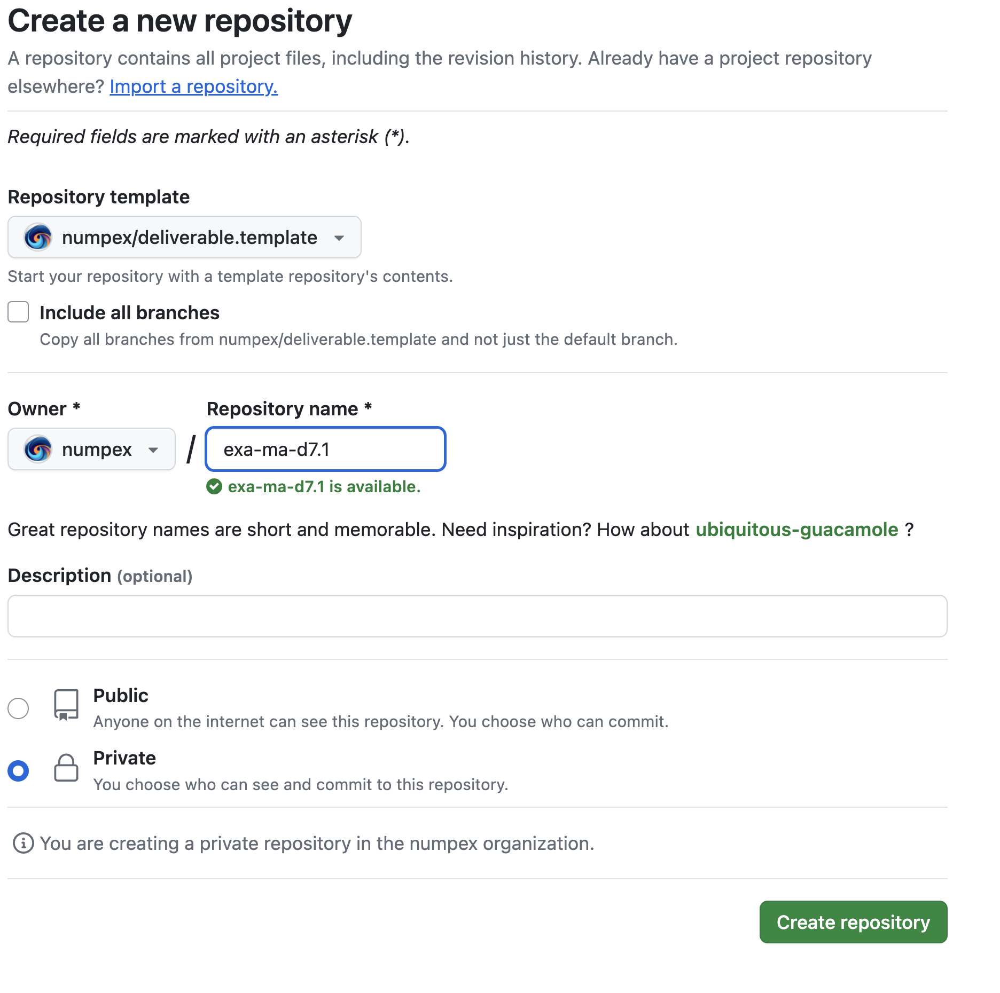

= LaTeX style files for NumPEx deliverables.
:figure-caption!:

.Zenodo DOI
--
image::https://zenodo.org/badge/DOI/10.5281/zenodo.13341126.svg[DOI, link=https://doi.org/10.5281/zenodo.13341126]
--

.GitHub Information
--
image:https://img.shields.io/github/v/release/numpex/exa-ma-d7.1[GitHub Release]
image:https://img.shields.io/github/actions/workflow/status/numpex/exa-ma-d7.1/latex.yml[GitHub Actions Workflow Status]
image:https://img.shields.io/github/downloads/numpex/exa-ma-d7.1/total[GitHub Downloads (all assets, all releases)]
--

== Introduction

This repository contains a LaTeX style for deliverables in the context of the French initiative for Exascale computing NumPEx. 

This style is based on the deliverable template provided by the European project Hyperride.

== Basic usage:

Create a repository for your deliverable and use this repo as template.

.Create a new repository from exa-ma-d7.1

The basic structure of a deliverable formatted according with these
styles should be (minimally):

    \documentclass[11pt]{report}
    \usepackage{numpex}  
    
    \begin{document}
    
    %% a Changelog. Each call to \istChange adds an entry to the
    %% changelog. After LaTeX is run, it will generate a table on page 2
    %% containing all changes. N.B.: I could not find a way to generate
    %% this table directly, so the whiledo{} loop in istprog.sty writes
    %% the changelog table to a temp file (more or less the way tables of
    %% content are generated), so you have to run LaTeX twice to update
    %% this table (as you would to update the TOC).
    \istChange{dd/mm/yyyy}{v1.o}{Name (Partner short name)}{Draft report template}
    \istChange{...}{}{...}{}
    \istChange{}{}{}{}

    %% Deliverable information
    \ProjectAcronym{numpex}
    \ProjectFullTitle{Hybrid Provision of Energy based on Reliability and Resiliency by Integration of Dc Equipment}
    \ProjectRefNo{957788}
    \delivNumber{Dx.y}
    \delivName{[Title as appears in the DoA]}
    \delivShortTile{Short Title}
    %% Lead partner
    \delivResponsible{[Responsible partner]} 
    \delivVersion{vn.n}
    \ActualDate{dd/mm/yyyy}
    \delivDissLevel{CO}
    \delivType{[Report, Prototype, Other]}
    \delivWP{WPx} % Workpackage x; not used at the moment
    \delivAuthor{Names of co-authors  (partners short names)}
    \delivFPAuthor{Names of co-authors  (partners short names)}
    \delivStatus{Draft}
    \delivKeywords{[List of free keywords relevant to the deliverable]}
    \delivTask{Tn.n}
    \delivStatus{[Draft, v1.0, v2.0, Final version]}
    \delivExecSummary{This is a summary of the deliverable; a paragraph or
    so to go on the cover page} 
    
    \makecover
    % page 3: table of contents
    \newpage
    \fancypagestyle{plain}{}
    
    \settableofcontents
    \tableofcontents
    
    \vfill
    \section*{List of abbreviations}
    
    \begin{tabular}[h]{ll}
     EC	        &	European Commission \\
     DoA	&	Description of Action\\
    \end{tabular}
    
    
    \newpage
    \section{Your first section}
    
    \subsection{A subsection of your first section}
    
    etc
    
    \bibliography{your-bib-file}
    \bibliographystyle{apacite} %% recommended 
    \{document}

== Further details

See exa-ma-d7.1.tex/exa-ma-d7.1.pdf in this directory.

If you have any thoughts on how to improve this style, feel free to
implement them and share your results. The same goes for bug fixes.

Just clone the project and 'Have fun!'
